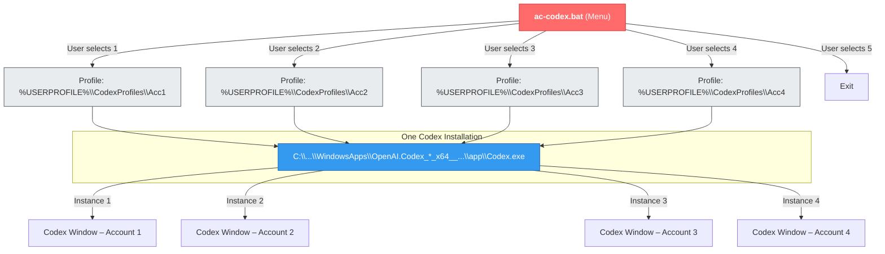

<!-- PROJECT HEADER -->
<br />
<div align="center">
  <a href="https://github.com/Ali-hey-0/Codex-Account-Selector">
    
  </a>

  <h1 style="font-size: 3rem;">Codex Account Selector</h1>

  <p>
    🧠 Launch multiple isolated Codex AI instances on Windows – one click, zero bloat.
  </p>

  <!-- BADGES -->
  <p>
    <a href="https://github.com/Ali-hey-0/Codex-Account-Selector/releases">
      
    </a>
    <a href="https://github.com/Ali-hey-0/Codex-Account-Selector/blob/main/LICENSE">
      
    </a>
    
    
    <a href="https://github.com/Ali-hey-0/Codex-Account-Selector/stargazers">
      
    </a>
    <a href="https://github.com/Ali-hey-0/Codex-Account-Selector/network/members">
      
    </a>
    
  </p>

  <p>
    <a href="#-quick-start">Quick Start</a> •
    <a href="#-features">Features</a> •
    <a href="#-architecture">Architecture</a> •
    <a href="#-faq">FAQ</a> •
    <a href="#-author-opinion">Author's Opinion</a>
  </p>
</div>

<details>
  <summary><strong>📑 Table of Contents</strong> (click to expand)</summary>

- [🚀 Quick Start](#-quick-start)
- [✨ Features](#-features)
- [🏗️ Architecture – The N→N Model](#️-architecture--the-nn-model)
- [📋 Prerequisites](#-prerequisites)
- [💾 Installation](#-installation)
- [🖥️ Usage](#️-usage)
- [🔧 Customization](#-customization)
  - [Adding More Accounts](#adding-more-accounts)
  - [Changing Profile Storage Path](#changing-profile-storage-path)
  - [Using a Non‑Standard Installation](#using-a-nonstandard-installation)
  - [Environment Variables](#environment-variables)
- [🗂️ File Structure](#️-file-structure)
- [🔐 Security & Isolation](#-security--isolation)
- [🆚 Comparison with Alternatives](#-comparison-with-alternatives)
- [❓ FAQ](#-faq)
- [🛠️ Troubleshooting](#️-troubleshooting)
- [📄 License](#-license)
- [🤝 Contributing](#-contributing)
- [💬 Support](#-support)
- [⭐ Show Your Support](#-show-your-support)
- [✒️ Author's Opinion](#️-authors-opinion)
</details>


## 🚀 Quick Start

1. **Download** the [latest `ac-codex.bat`](https://github.com/Ali-hey-0/Codex-Account-Selector/releases/latest) from this repository.
2. **Double‑click** the script.
3. **Pick an account** (1‑4) and a fresh Codex window opens instantly.

Repeat for any other account – they all run side‑by‑side, completely isolated.

> 💡 No installation, no admin rights needed. The script lives wherever you put it.

### 📸 See It In Action

<div align="center">
  
  <p><em>Multiple Codex instances running simultaneously with full isolation</em></p>
</div>

---

## ✨ Features

- 🧩 **True Multi‑Account Isolation** – Each profile keeps cookies, sessions, extensions, and settings strictly separated.
- ⚡ **One‑Click Launcher** – Friendly numeric menu; no more typing long terminal commands.
- 🔍 **Auto‑Detection** – Finds the latest Codex installation inside `WindowsApps` automatically.
- 🪶 **Zero Dependencies** – A single, pure Windows Batch file (less than 2 KB).
- 🛡️ **Safe by Design** – Leverages Chromium's own sandbox; profiles are simple folders you can back up or delete.
- 🎨 **Highly Customizable** – Add/rename accounts, change paths, or hardcode the executable in seconds.
- 🧵 **Concurrent Friendly** – Run as many instances as your RAM allows.


## 🏗️ Architecture – The N→N Model

Every Electron/Chromium app (like Codex) honours the `--user-data-dir` command‑line flag. When you supply a unique folder path, **all local state** – authentication tokens, preferences, cache[...]

This script takes **one** installed copy of `Codex.exe` and launches **N** independent processes, each pointed at a distinct `--user-data-dir`. The result is a clean **N executables → N data di[...]



There are no symlinks, virtual machines, or container engines – just the application doing exactly what it was designed to do, in parallel.


## 📋 Prerequisites

| Component   | Minimum                      | Recommended        |
|-------------|------------------------------|--------------------|
| Windows     | Windows 10 (build 19041+)    | Windows 11 22H2+   |
| Codex       | Microsoft Store or winget    | Latest stable      |
| Permissions | Standard user                | Read access to WindowsApps* |
| Disk Space  | ~500 MB per extra profile    | 2+ GB free on system drive |

* The script reads the directory listing of WindowsApps to auto‑detect the latest Codex version. Windows allows this by default for all users.

---

## 💾 Installation

### Option 1: Clone (Git)

```bash
git clone https://github.com/Ali-hey-0/Codex-Account-Selector.git
cd Codex-Account-Selector
```

Then double‑click ac-codex.bat.

### Option 2: Download the Raw File

1. Visit the latest release page.
2. Download ac-codex.bat and save it anywhere (Desktop, Documents, even a USB stick).

🔧 **Optional:** Create a shortcut to ac-codex.bat, set a nice icon, and pin it to your taskbar for one‑click access.

---

## 🖥️ Usage

Launch the script by double‑clicking or via command line:

```
C:\Tools> ac-codex.bat
```

You'll see:

```
=====================================
      Codex Account Selector
=====================================
 1. Run Account 1
 2. Run Account 2
 3. Run Account 3
 4. Run Account 4
 5. Exit
=====================================
Enter your choice (1-5):
```

- Type the number of the desired account and press Enter.
- A new Codex window will open. The first launch creates the profile folder (may take a few seconds longer).
- To launch additional accounts, keep the menu open and choose another number. Each will open a completely independent window.

🧪 **Tip:** You can log into different Codex / OpenAI accounts in each window, or use the same account with different workspaces – it's up to you.

---

## 🔧 Customization

Open ac-codex.bat with any text editor (Notepad, VS Code, etc.). The variables at the top control all behaviour.

### Adding More Accounts

Copy the menu entry pattern. For a 5th account, add:

```batch
if "%choice%"=="5" set "ACC_NAME=Acc5" & goto launch
```

Update the menu display to reflect the new options.

### Changing Profile Storage Path

By default, profiles are stored under %USERPROFILE%\CodexProfiles. To use another drive (e.g., D:\MyProfiles), modify:

```batch
set "CODEX_HOME=D:\MyProfiles\%ACC_NAME%"
```

You can also use an environment variable for portability:

```batch
set "CODEX_HOME=%MY_CUSTOM_PATH%\%ACC_NAME%"
```

### Using a Non‑Standard Installation

If you installed Codex outside WindowsApps (portable, custom folder), simply set the full path:

```batch
set "APP_DIR=C:\PortableApps\Codex\Codex.exe"
```

The script will skip auto‑detection when APP_DIR is already defined.

### Environment Variables

For advanced automation, you can set the following before running the script:

| Variable       | Description                              | Default                      |
|----------------|------------------------------------------|------------------------------|
| CODEX_PROFILES | Root folder for all account profiles      | %USERPROFILE%\CodexProfiles  |
| CODEX_EXE      | Full path to Codex.exe                   | (auto‑detected)              |

If these variables exist, the script will use them, overriding its internal defaults.

---

## 🗂️ File Structure

```
Codex-Account-Selector/
├── ac-codex.bat          # The main launcher script
├── LICENSE               # MIT License
├── README.md             # This file
└── assets/
    └── logo.png          # Project logo (optional)
```

The script creates profile directories dynamically:

```
%USERPROFILE%\CodexProfiles\
├── Acc1\                  # Data for Account 1
│   ├── Local State
│   ├── Cookies
│   ├── ...
├── Acc2\                  # Data for Account 2
├── Acc3\
└── Acc4\
```

---

## 🔐 Security & Isolation

- Each --user-data-dir folder is a fully self‑contained Chromium profile.
- Cookies, session tokens, and localStorage never cross between accounts.
- No registry keys are modified; no system‑wide changes occur.
- You can delete a profile folder at any time – all traces of that account vanish.
- For extra security, consider storing profiles on an encrypted drive (e.g., BitLocker, VeraCrypt). The script works flawlessly with those paths.

---

## 🆚 Comparison with Alternatives

| Approach                                  | Isolation         | Resource Usage    | Ease of Use       | Reliability          |
|-------------------------------------------|-------------------|-------------------|-------------------|----------------------|
| --user-data-dir (this tool)               | ✅ Complete       | 🟢 Minimal        | ⭐⭐⭐⭐⭐    | ✅ Built-in          |
| Multiple Windows user accounts            | ✅ Complete       | 🔴 High (full OS overhead) | ⭐⭐ | ⚠️ Complex |
| Sandboxie / Firejail                      | ⚠️ Partial        | 🟡 Moderate       | ⭐⭐⭐         | ❌ External dependency |
| Virtual Machines                          | ✅ Complete       | 🔴 Very High      | ⭐              | ✅ but overkill      |
| Container (Docker)                        | ✅ Complete       | 🟡 Moderate       | ⭐⭐            | ❌ Not native on Windows |

The --user-data-dir approach is the only method that delivers perfect isolation without adding complexity, bloat, or external dependencies.

---

## ❓ FAQ

<details>
<summary><strong>Can I run more than four accounts?</strong></summary>
Absolutely. The script is a template – expand the menu to 10, 20, or even 100 entries. The underlying mechanism has no hard limit.
</details>

<details>
<summary><strong>Does this affect my original Codex installation?</strong></summary>
No. The original executable inside `Program Files\WindowsApps` is never touched. Each instance writes exclusively to its own profile folder.
</details>

<details>
<summary><strong>Can I transfer a profile to another PC?</strong></summary>
Yes. Simply copy the profile folder (e.g., `Acc1`) to the same relative path on the new machine, and Codex will pick up the exact session.
</details>

<details>
<summary><strong>Why does the script search for <code>OpenAI.Codex_*_x64__2p2nqsd0c76g0</code>?</strong></summary>
That's the official Microsoft Store package name. The wildcard `*` handles version updates so the script always finds the current installation.
</details>

<details>
<summary><strong>Will this stop working if Codex updates?</strong></summary>
Only if OpenAI changes the install location or the executable name. The script is designed to be resilient, and you can always hardcode the path if needed.
</details>

<details>
<summary><strong>I see multiple Codex icons on the taskbar – is that normal?</strong></summary>
Yes. Each instance is a separate process with its own window. Windows treats them independently, which is exactly what we want.
</details>

---

## 🛠️ Troubleshooting

<details>
<summary><strong>"Error: Codex installation directory not found."</strong></summary>

**Cause:** The script cannot locate the Codex folder inside WindowsApps.

**Fix:**

- Make sure Codex is installed via Microsoft Store or winget.
- If installed elsewhere, manually set APP_DIR in the script.
- Ensure your user has read access to C:\Program Files\WindowsApps. (Open the folder once via File Explorer to trigger the permission prompt.)

</details>

<details>
<summary><strong>"Access is denied" when launching</strong></summary>

**Cause:** Windows may block the script or your account lacks execute rights.

**Fix:**

- Right‑click ac-codex.bat → Properties → check Unblock if the option exists.
- Temporarily disable aggressive antivirus if it flags the script.
- Try running the script from a folder where you have full control (e.g., Desktop).

</details>

<details>
<summary><strong>Codex windows take a long time to open</strong></summary>

**Cause:** First‑run profile generation (caches, local storage) can be slow on HDDs.

**Fix:** Wait up to 2 minutes. Subsequent launches are almost instant. If it persists, delete the profile folder and let it recreate.

</details>

<details>
<summary><strong>I get a blank/white window</strong></summary>

**Cause:** GPU acceleration or corrupted profile.

**Fix:** Add --disable-gpu to the launch command in the script, or delete the profile folder.

</details>

---

## 📄 License

Distributed under the MIT License. See LICENSE for more information.
Feel free to use, modify, and share this project freely.

---

## 🤝 Contributing

Contributions are what make the open‑source community so incredible. Any improvements you make are greatly appreciated.

1. Fork the Project
2. Create your Feature Branch (git checkout -b feature/AmazingFeature)
3. Commit your Changes (git commit -m 'Add some AmazingFeature')
4. Push to the Branch (git push origin feature/AmazingFeature)
5. Open a Pull Request

Please keep the script lightweight and avoid external dependencies unless absolutely necessary.

---

## 💬 Support

- Bug reports & feature requests → GitHub Issues
- Community discussions → GitHub Discussions
- Direct contact → aliheydari1381doc@gmail.com

---

## ⭐ Show Your Support

If this project saved you time or made your life easier, give it a Star ⭐ on GitHub! It motivates us to keep improving.

<a href="https://www.buymeacoffee.com/alihey0" target="_blank">
  
</a>

---

## ✒️ Author's Opinion

When I first needed two Codex accounts open simultaneously, I looked at the obvious solutions: virtual machines, separate Windows users, third‑party sandboxing tools. Every single one of them f[...]

Then I remembered: Chromium apps have a native --user-data-dir flag. It's not a workaround – it's an intended feature that Electron and Chrome developers use every day for testing and multi‑p[...]

Here's why I believe this is the most elegant, zero‑bloat solution ever:

- 🧬 **Native & future‑proof** – No hooks, no patches, no reliance on undocumented behaviour. It will work as long as Codex is an Electron app.
- 🚫 **True zero‑bloat** – The entire "tool" is a single batch file smaller than many icons. Contrast that with a multi‑gigabyte VM image.
- 🔐 **Perfect isolation by design** – Each profile is a folder. You can back it up, encrypt it, or nuke it without touching anything else.
- 🧰 **Hackable to the core** – Advanced users can extend it with custom parameters, pre‑configured workspaces, or launch scripts without ever touching the original installation.
- 🏎️ **Resource‑friendly** – Running 4 Codex instances uses only marginally more RAM than 1, because the core runtime is shared. Compare that to 4 VMs.

I wrote this script because I needed it myself. Seeing others adopt it and adapt it for their workflows – that's the true spirit of open source. To the maintainer, ali-hey-0: you've turned a co[...]

Happy coding – one instance at a time. 🚀
